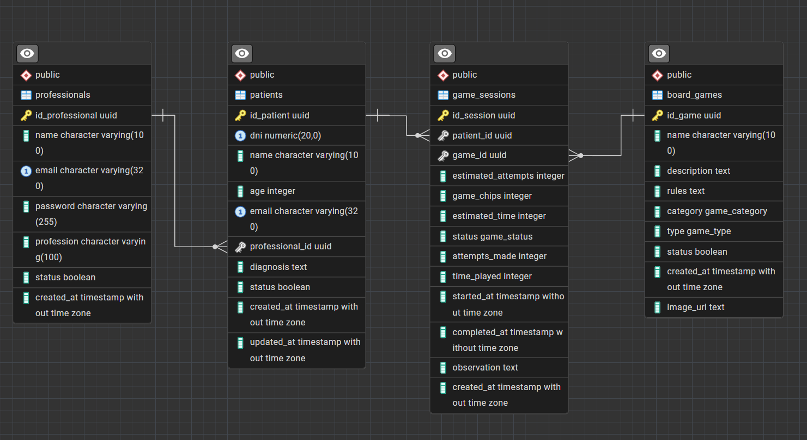
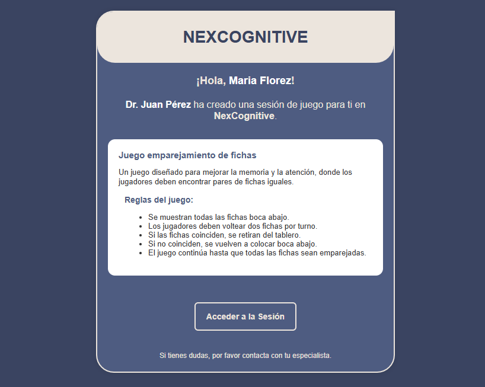
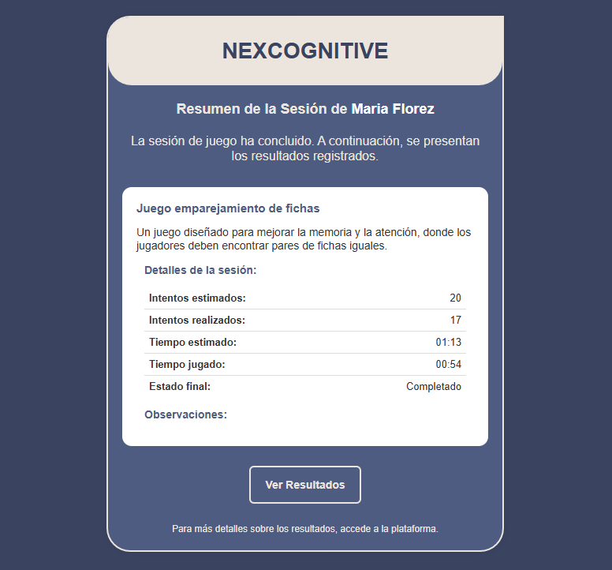

# 🧠 NexCognifive - Backend


<div align="center">
    
    
    
    
    
    
    
</div>

## 📋 Índice
- [📝 Descripción](#-descripción)
- [✨ Características](#-características)
- [💻 Tecnologías](#-tecnologías)
- [📦 Dependencias](#-dependencias)
- [🔧 Requisitos](#-requisitos)
- [📊 Base de Datos](#-base-de-datos)
- [📧 Notificaciones por Correo](#-notificaciones-por-correo)
- [📥 Instalación](#-instalación)
- [🚀 Guía de Uso](#-guía-de-uso)
- [🔗 Endpoints](#-endpoints)
  - [🔐 Endpoint de Autenticación](#-endpoint-de-autenticación)
  - [🏥 Endpoints de Pacientes](#-endpoints-de-pacientes)
  - [🎲 Endpoints de Juegos](#-endpoints-de-juegos)
  - [🎮 Endpoints de Sesiones de Juego](#-endpoints-de-sesiones-de-juego)
  - [📊 Endpoints del Dashboard](#-endpoints-del-dashboard)
- [📁 Estructura del Proyecto](#-estructura-del-proyecto)
- [📌 Convenciones de Código](#-convenciones-de-código)
- [🧑‍💻 Equipo de Desarrollo](#-equipo-de-desarrollo)


## 📝 Descripción

El backend de **NexCognifive** es una API REST desarrollada con Spring Boot, encargada de gestionar la lógica de negocio de la plataforma. Su principal función es proporcionar autenticación segura para profesionales, permitiéndoles administrar pacientes, asignar juegos cognitivos y realizar un seguimiento detallado del desempeño a través de estadísticas avanzadas.

La API proporciona endpoints seguros mediante JWT (JSON Web Tokens) y Spring Security, asegurando un acceso controlado y protegido a la información. Además, integra un sistema de notificaciones por correo electrónico para alertar a los profesionales sobre los resultados de sus pacientes. También se cuenta con documentación interactiva mediante Swagger, facilitando la exploración y prueba de los endpoints disponibles.


## ✨ Características
- Autenticación segura con JWT y Spring Security, garantizando control de acceso y protección de datos.
- Gestión de sesiones de juego, con generación de enlaces personalizados enviados automáticamente al paciente por correo electrónico.
- Seguimiento del progreso, proporcionando estadísticas detalladas sobre el desempeño de los pacientes.
- Notificaciones automáticas por correo electrónico al completar o cancelar una sesión de juego.
- Configuración de CORS, permitiendo una comunicación segura con el frontend.
- Base de datos con PostgreSQL y manejo de entidades mediante JPA/Hibernate.
- Documentación interactiva con Swagger UI, facilitando la exploración y prueba de los endpoints de la API.

## 💻 Tecnologías
- **Spring Boot**: Framework que facilita el desarrollo ágil de aplicaciones en Java, permitiendo una configuración mínima.
- **PostgreSQL**: Sistema de gestión de bases de datos relacional utilizado para almacenar la información de la API.
- **JWT (JSON Web Token)**: Tecnología para la autenticación y autorización de usuarios mediante tokens seguros.
- **API REST**: Protocolo de comunicación que permite realizar operaciones de consulta sobre los datos almacenados.
- **Springdoc OpenAPI**: Biblioteca para la generación automática de documentación de la API en aplicaciones Spring Boot, que utiliza **Swagger UI** para visualizar y probar los endpoints de manera interactiva.

## 📦 Dependencias

Para que la API funcione correctamente, asegúrate de incluir las siguientes dependencias:

- **Spring Data JPA**: Facilita el acceso a bases de datos mediante la integración de JPA (Java Persistence API) para el manejo de datos en una base de datos relacional.
- **Spring Security**: Framework para la protección de aplicaciones mediante autenticación y autorización, gestionando la seguridad de la API.
- **Spring Boot Starter Validation**: Proporciona herramientas para validar objetos, parámetros de entrada y controlar los errores en la API.
- **Spring Boot Starter Web**: Proporciona las dependencias necesarias para construir una aplicación web, incluyendo controladores RESTful y manejo de solicitudes HTTP.
- **Flyway**: Herramienta para gestionar migraciones de bases de datos, que asegura que la estructura de la base de datos se mantenga consistente a lo largo del tiempo.
- **PostgreSQL Connector**: Controlador JDBC para interactuar con bases de datos PostgreSQL desde Java.
- **Lombok**: Biblioteca que facilita la creación de código repetitivo como getters, setters y constructores, usando anotaciones en el código.
- **Spring Boot DevTools**: Herramienta para mejorar la experiencia de desarrollo mediante recarga automática, depuración mejorada y más.
- **Java JWT (java-jwt)**: Biblioteca que permite trabajar con tokens JWT (JSON Web Tokens) para la autenticación y autorización de usuarios.
- **SpringDoc OpenAPI Starter**: Integra la especificación OpenAPI para documentar automáticamente los endpoints de la API.
- **Spring Boot Starter Mail**: Proporciona las herramientas necesarias para enviar emails desde la API, útil para el envío de correos al profesional y al paciente.

Asegúrate de agregar las dependencias en el archivo `pom.xml` del proyecto Maven.

## 🔧 Requisitos

- JDK 17 o superior
- Maven para la gestión de dependencias
- PostgreSQL
- IntelliJ IDEA (o cualquier otro IDE compatible con Java)
- Un servidor de email para el envio de notificaciones

## 📊 Base de Datos

La API utiliza PostgreSQL como sistema de gestión de bases de datos, la cual almacena información relacionada con los profesionales, pacientes, juegos y sesión de juegos. A continuación se muestra el diagrama de la base de datos que representa las tablas y las relaciones entre ellas:




Este diagrama proporciona una visión clara de la estructura de datos de la aplicación, detallando las relaciones entre las siguientes entidades principales:

- **Professionals**: Gestiona los datos de los profesionales que administran a los pacientes y asignan sesiones de juego.
- **Patients**: Contiene la información de los pacientes registrados por el profesional.
- **Board Games**: Almacena los juegos cognitivos disponibles para las sesiones de entrenamiento.
- **Game Sessions**: Registra las sesiones de juego asignadas a los pacientes, incluyendo su estado y resultados.

## 📧 Notificaciones por Correo
El sistema envía notificaciones automáticas por correo electrónico tanto al profesional como al paciente en los siguientes casos:

- **Cuando se asigna una nueva sesión de juego:** El paciente recibe un enlace para acceder a la sesión.
- **Cuando se completa o cancela una sesión:** El profesional recibe un resumen del desempeño del paciente.

A continuación, se muestran ejemplos de las notificaciones enviadas:

### 📩 Correo enviado al paciente con el acceso a la sesión de juego.


### 📩 Correo enviado al profesional con el resumen de la sesión.



## 📥 Instalación

1. **Clona el repositorio**:
    ```bash
    git clone git@github.com:No-Country-simulation/c24-71-ft-webapp.git
    ```

2. **Accede al directorio del proyecto**:
    ```bash
    cd c24-71-ft-webapp
    ```

3. **Crear la base de datos en PostgreSQL:**

    Antes de ejecutar el Backend, es necesario crear la base de datos.

    - Abre PostgreSQL y ejecuta el siguiente comando para crear la base de datos:

        ```sql
        CREATE DATABASE your_database_name;
        ```

    - Reemplaza `your_database_name` con el nombre real.

4. **Abrir el backend en IntelliJ IDEA o un IDE compatible:**

    - Abre IntelliJ IDEA (o un IDE similar compatible con Spring Boot y Maven).
    - Desde el menú, selecciona "Open" y elige la carpeta `Backend`.

5. **Instalar o actualizar las dependencias:**

   - En IntelliJ IDEA, abre la pestaña "Maven" en la barra lateral derecha.

   - Haz clic en el botón "Reload All Maven Projects" para actualizar las dependencias.

6. **Agrega las variables de entorno:**

    Agrega las siguientes variables en la configuración del sistema operativo o en la configuración del IDE.

    ```dotenv
    # 📊 Base de Datos
    DB_SRC=jdbc:postgresql://localhost:5432/your_database_name
    DB_USER=your_username
    DB_PASSWORD=your_password

    # 🔑 Clave Secreta para JWT
    JWT_SECRET=your_secret_jwt

    # 📧 Configuración del Servidor de Email
    EMAIL_HOST=your_email_host
    EMAIL_PORT=your_email_port
    EMAIL_USER=your_email_user
    EMAIL_PASS=your_email_password

    # 🌍 Configuración del Frontend
    FRONTEND_CORS_URL=http://localhost:5173
    FRONTEND_REDIRECT_URL=http://localhost:5173
    ```
    Reemplaza los valores de ejemplo con los detalles reales de tu entorno.

7. **Ejecutar el servidor backend**:

    - En IntelliJ IDEA, abre el archivo principal de la aplicación: `NexcognifixApplication.java`

    - Haz clic en el botón "Run" en la parte superior del IDE para ejecutar la aplicación.

    Esto iniciará el servidor en `http://localhost:8080` (por defecto).

## 🚀 Guía de Uso

### Acceso a la API REST
- Una vez que la aplicación esté en ejecución, podrás acceder a la API REST a través de la URL base:

  ```
  http://localhost:8080/api
  ```
- Asegúrate de que el puerto configurado en tu aplicación sea el correcto (por defecto, es 8080).

### Documentación de la API
- La documentación de la API está disponible a través de [Swagger UI](http://localhost:8080/api/docs/swagger-ui/index.html) una vez que la aplicación esté ejecutándose, podrás explorar los endpoints disponibles y realizar pruebas directamente desde tu navegador.  

   ```
   http://localhost:8080/api/docs/swagger-ui/index.html
   ```
- También puedes acceder a la documentación de forma remota:

  👉 [Swagger UI - Remoto](https://nexcognitive-api.onrender.com/api/docs/swagger-ui/index.html)


## 🔗 Endpoints
A continuación, se presenta la lista completa de endpoints disponibles en la API. Todos los endpoints comienzan con el prefijo `/api`.

### 🔐 Endpoint de Autenticación
Este endpoint permite a los profesionales autenticarse en la plataforma mediante su correo electrónico y contraseña.


| Endpoint  | Método | Descripción |
|-----------|--------|-------------|
| `/login` | `POST` | Autentica a un profesional con su correo y contraseña, devolviendo un token JWT si las credenciales son correctas. 

### 🏥 Endpoints de Pacientes
Estos endpoints permiten a los profesionales gestionar sus pacientes, incluyendo la creación, edición, listado y desactivación. Todos los pacientes están vinculados al profesional autenticado.  


| Endpoint         | Método  | Descripción |
|-----------------|---------|-------------|
| `/patients`     | `GET`   | Obtiene una lista paginada de pacientes, filtrable por **DNI** o **nombre**. |
| `/patients/{id}` | `GET`   | Obtiene el **detalle de un paciente** específico por su **ID**. |
| `/patients`     | `POST`  | Crea un nuevo paciente asignado al profesional autenticado. |
| `/patients/{id}` | `PUT`   | Actualiza la información de un paciente existente. |
| `/patients/{id}` | `DELETE` | **Desactiva** un paciente (eliminación lógica). |


### 🎲 Endpoints de Juegos
Estos endpoints permiten obtener información sobre los juegos, incluyendo la lista de juegos filtrados y las categorías y tipos disponibles.

| Endpoint            | Método  | Descripción |
|---------------------|---------|-------------|
| `/board-games` | `GET`   | Obtiene una lista de juegos, filtrando opcionalmente por **categoría** y/o **tipo**. |
| `/board-games/filters` | `GET`   | Recupera las categorías y tipos disponibles de juegos. |


### 🎮 Endpoints de Sesiones de Juego
Estos endpoints permiten la gestión de las sesiones de juego, incluyendo su creación, inicio, cancelación y almacenamiento de resultados.

| Endpoint                                       | Método  | Descripción |
|-----------------------------------------------|---------|-------------|
| `/game-sessions/create`                       | `POST`  | Crea una nueva sesión de juego y envía un correo al paciente con los detalles. |
| `/game-sessions/{sessionId}/email/resend`     | `POST`  | Reenvía un correo con la información de la sesión de juego. |
| `/game-sessions/patient/join/{sessionId}`     | `GET`   | Obtiene los detalles de una sesión de juego específica. |
| `/game-sessions/patient/join/{sessionId}/start`  | `PATCH` | Cambia el estado de la sesión de juego a "En progreso". |
| `/game-sessions/patient/join/{sessionId}/cancel` | `PATCH` | Cancela una sesión de juego con una observación. |
| `/game-sessions/patient/join/{sessionId}/results` | `POST`  | Guarda los resultados de la sesión de juego y los envía al profesional. |
| `/game-sessions/patient/{patientId}`          | `GET`   | Lista todas las sesiones de juego asociadas a un paciente. |

### 📊 Endpoints del Dashboard
Estos endpoints proporcionan estadísticas y el historial de juegos para los profesionales autenticados.

| Endpoint                         | Método | Descripción |
|----------------------------------|--------|-------------|
| `/dashboard/latestgames`        | `GET`  | Obtiene las **10 últimas sesiones de juego** creadas por el profesional autenticado. |
| `/dashboard/statistics`         | `GET`  | Obtiene estadísticas generales sobre las sesiones de juego y los pacientes activos. |
| `/dashboard/sessions-per-day`   | `GET`  | Obtiene un resumen del **número de sesiones de juego creadas por día** en la última semana o en el rango de fechas especificado. |
| `/dashboard/games-played-month` | `GET`  | Muestra cuántos juegos han sido **completados, cancelados o están en progreso** durante el mes actual. |
| `/dashboard/summary-statistics` | `GET`  | Obtiene estadísticas detalladas sobre los juegos creados, completados y pendientes, además del número de pacientes activos. |

## 📁 Estructura del Proyecto

El proyecto sigue una organización basada en capas para garantizar una separación clara de responsabilidades:

```
Backend/ 
├─ README.md                     # Documentación general del proyecto
├─ Dockerfile                    # Configuración para deploy en Docker
├─ LICENSE                        # Licencia del proyecto
├─ pom.xml                        # Archivo de configuración de Maven
└─ src/
   ├─ main/
   │   ├─ java/c24_71_ft_webapp/nexcognifix
   │   │   ├─ controller/
   │   │   │   └─ BoardGameController
   │   │   │   └─ DashboardController
   │   │   │   └─ GameSessionController
   │   │   │   └─ LoginController
   │   │   │   └─ PatientController
   │   │   ├─ domain/
   │   │   │   └─ boardgame/...
   │   │   │   └─ dashboard/...
   │   │   │   └─ gamesession/...
   │   │   │   └─ professional/...
   │   │   │   └─ patient/
   │   │   │       ├─ Patient             # Entidad / Modelo
   │   │   │       ├─ PatientService      # Servicio
   │   │   │       ├─ PatientRepository   # Repositorio
   │   │   │       └─ dto/                # Transferencia de datos
   │   │   │           └─ PatientDTO
   │   │   ├─ infrastructure/
   │   │   │   ├─ security/                    # Seguridad
   │   │   │   ├─ config/                      # Configuración general
   │   │   │   └─ exception/                   # Manejo de excepciones
   │   │   └─ NexcognifixApplication
   │   └─ resources/
   │       ├─ application.properties           # Configuración de la app
   │       └─ db/
   │           └─ migration/
   │               └─ V1__Create_Professionals_Table
   └─ test/
       └─ java/c24_71_ft_webapp/nexcognifix/

```

### 🔹 Descripción de carpetas principales:

- **controller/**: Contiene los controladores de la API que manejan las solicitudes HTTP.
- **domain/**: Incluye la lógica de negocio, modelos de datos y DTOs organizados por funcionalidad.
- **infrastructure/**: Define la configuración, servicios de seguridad, manejo de excepciones y servicios auxiliares.
- **resources/**: Archivos de configuración y migraciones de base de datos.

## 📌 Convenciones de Código

Para mantener un código limpio y homogéneo, se deben seguir las siguientes convenciones:

### 1️⃣ Nomenclatura

- **Clases y archivos**: `PascalCase` (ProfessionalService, GameController).
- **Métodos y variables**: `camelCase` (getProfessionalById(), gameService).
- **Constantes**: `UPPER_CASE_SNAKE_CASE` (MAX_ATTEMPTS, DEFAULT_TIME).
- **DTOs**: Agregar `DTO` al final (ProfessionalDTO, GameDTO).

### 2️⃣ Estructura de Código

- Cada clase debe estar en el paquete correspondiente según su responsabilidad.
- Separar lógica de negocio en servicios (`Service`) y mantener controladores ligeros.
- `DTOs` deben utilizarse para transferir datos entre capas y evitar exposición de entidades.
- Métodos deben ser cortos y con una única responsabilidad.

### 3️⃣ Idiomas

- Nombres de variables, métodos y clases siempre en **inglés**.

## 🧑‍💻 Equipo de Desarrollo

<div align="center">

| **Hector Suarez** | **Jissy Merlano** | **Rosario Díaz** | **William Medina** |
| :-------- |  :-------- |  :-------- |  :-------- |
|  |  |  |  | 
| [](https://www.linkedin.com/in/hector-suarez-001415242/)| [](https://www.linkedin.com/in/ing-jissy-merlano/)| [](https://www.linkedin.com/in/madelrosariodiaz/)| [](https://www.linkedin.com/in/william-medinaa/)|
| [](https://github.com/TheHector2614)| [](https://github.com/jissykakin)| [](https://github.com/ChayChaio)| [](https://github.com/william-medina)|

</div>