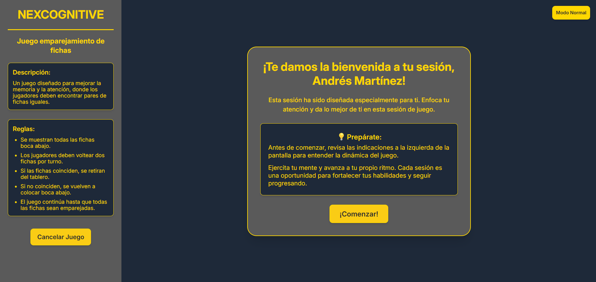
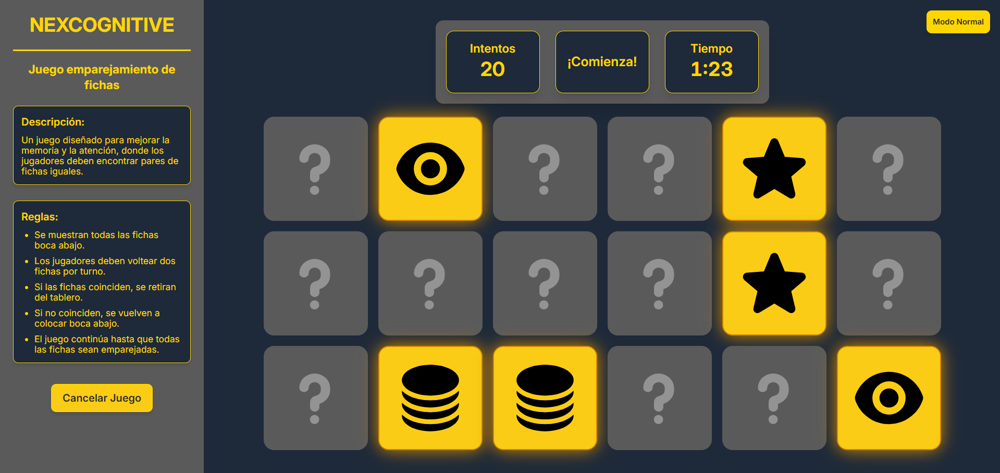
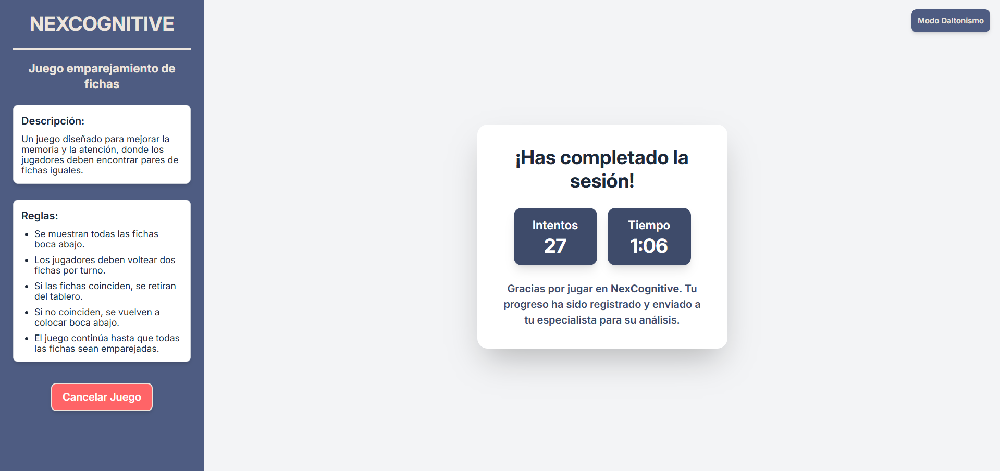
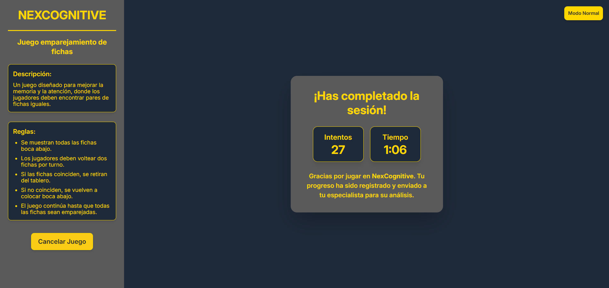

# 🧠 NexCognifive - Frontend


## 📋 Índice
- [📝 Descripción](#-descripción)
- [✨ Características](#-características)
- [💻 Tecnologías](#-tecnologías)
- [🔧 Requisitos](#-requisitos)
- [📥 Instalación](#-instalación)
- [🚀 Guía de Uso](#-guía-de-uso)
  - [✅ Acceso a la Plataforma](#-acceso-a-la-plataforma)
  - [✅ Enviar Juegos a Pacientes](#-enviar-juegos-a-pacientes)
  - [✅ Ejecución del Juego por el Paciente](#-ejecución-del-juego-por-el-paciente)
  - [✅ Seguimiento y Estadísticas](#-seguimiento-y-estadísticas)
- [🔀 Rutas y Navegación](#-rutas-y-navegación)
- [🧑‍💻 Equipo de Desarrollo](#-equipo-de-desarrollo)

## 📝 Descripción

El frontend de **NexCognifive** es una aplicación web desarrollada con React y Tailwind CSS, diseñada para que los profesionales de la salud gestionen a sus pacientes y les asignen sesiones de juego para la estimulación cognitiva.

La plataforma facilita la asignación de juegos interactivos, el seguimiento del desempeño de los pacientes y la visualización de estadísticas detalladas. Además, incluye un **modo daltónico** que ajusta la paleta de colores para mejorar la experiencia de los pacientes con deficiencias en la percepción del color.

La aplicación está diseñada para integrarse con el backend de NexCognifive, utilizando una API REST segura con autenticación mediante JWT.


## ✨ Características

- Autenticación segura con JWT por parte del profesional.
- Gestión de pacientes: permite registrar, visualizar y administrar la información de los pacientes.
- Asignación de sesiones de juego enviados automáticamente al paciente por correo electrónico.
Modo de accesibilidad para daltónicos, optimizando la experiencia visual.
- Visualización de estadísticas detalladas sobre el desempeño de los pacientes en cada sesión.
- Notificaciones por correo, informando sobre los resultados de los pacientes.
- Integración con el backend, permitiendo una comunicación eficiente mediante una API REST.


## 💻 Tecnologías

- **React**: Una biblioteca de JavaScript para construir interfaces de usuario.
- **Tailwind CSS**: Un framework CSS basado en utilidades para el desarrollo rápido de interfaces.
- **Vite**: Una herramienta de construcción rápida y un servidor de desarrollo.
- **Axios**: Un cliente HTTP basado en promesas para hacer solicitudes al backend.
- **React Router DOM**: Un sistema de enrutamiento para manejar la navegación dentro de la aplicación de una sola página (SPA).
- **Heroicons**: Un conjunto de íconos diseñados para ser usados con Tailwind CSS.
- **React Hook Form**: Una librería para gestionar formularios de manera eficiente en React.
- **Recharts**: Una biblioteca de gráficos basada en React para visualizar datos de manera interactiva.
- **React Toastify**: Una librería para mostrar notificaciones en la interfaz de usuario de manera sencilla.

## 🔧  Requisitos
- Node.js (se recomienda la última versión LTS)
- NPM (Node Package Manager)

## 📥 Instalación

1. **Clona el repositorio**:
    ```bash
    git clone git@github.com:No-Country-simulation/c24-71-ft-webapp.git
    ```

2. **Accede al directorio del proyecto**:
    ```bash
    cd c24-71-ft-webapp
    ```

3. **Accede al directorio del Frontend**:
    ```bash
    cd Frontend
    ```

4. **Instalar las dependencias:**

   ```bash
   npm install
   ```

5. **Configura las variables de entorno:**

   Crea un archivo `.env.local` en la carpeta Frontend y agrega la siguiente variable con la URL de la API:

   ```dotenv
   VITE_API_URL=http://localhost:8080/api
   ```

6. **Ejecuta el servidor de desarrollo:**

   ```bash
   npm run dev
   ```

   Esto iniciará el servidor en `http://localhost:5173` (por defecto).

## 🚀 Guía de Uso

### ✅ Acceso a la Plataforma
1. Inicia sesión con una cuenta de profesional.  
2. Dirígete a la sección de **Pacientes** para visualizar el listado.  
3. Registra nuevos pacientes y gestiona su información. 

### 📸 Inicio de sesión:


### ✅ Enviar Juegos a Pacientes
1. Accede a la sección de **Juegos**.  
2. Selecciona el juego que deseas asignar a un paciente.  
3. Haz clic en **Asignar juego**, busca el paciente y configura la sesión:  
   - **Número de fichas mostradas en pantalla**.  
   - **Número de intentos estimado**.  
   - **Tiempo estimado para completar la sesión**.
4. Confirma la asignación. El paciente recibirá un correo con un enlace único para acceder a su partida.  

### 📸 Gestión de juegos:


### ✅ Ejecución del Juego por el Paciente
1. Al recibir el correo, el paciente podrá ver las instrucciones.  
2. Al hacer clic en el enlace, será redirigido a la sesión de juego asignada por el profesional.  
3. El paciente podrá **iniciar** o **cancelar** la sesión de juego:  
   - **Si cancela**, podrá enviar una observación sobre la cancelación.  
   - **Si inicia**, accederá al juego asignado por el profesional.  
     - **Juego asignado: Emparejamiento de fichas**  
       - Las fichas se revelarán durante **5 segundos** y luego se ocultarán.  
       - El paciente deberá emparejar todas las fichas.  
       - No hay límite de intentos ni tiempo.  

4. El paciente tiene acceso a un **modo para daltónicos**. Si lo requiere, puede pulsar el botón **Modo Daltonismo**, y los colores de la aplicación se ajustarán automáticamente para mejorar la accesibilidad.  

5. Al completar el juego, se enviarán automáticamente los resultados con:  
   - **Tiempo total empleado**.  
   - **Número de intentos realizados**.  

6. El profesional recibirá un correo con los datos de la sesión finalizada o una notificación si fue cancelada.  

### 📸 Menú de sesión de juego:

**Modo Normal** 


**Modo Daltonismo**  



### 📸 Ejecución del juego:

**Modo Normal** 


**Modo Daltonismo**  



### 📸 Resultados del juego:

**Modo Normal** 



**Modo Daltonismo**  


    

### ✅ Seguimiento y Estadísticas
1. El profesional puede visualizar en su **Dashboard**:  
   - Las últimas **10 sesiones de juego** asignadas.  
   - **Intentos, tiempo y fichas utilizadas** en cada sesión de juego.  
   - **Estadísticas globales** de los pacientes.  

### 📸 Dashboard:


## 🔀 Rutas y Navegación

La aplicación utiliza `React Router` para gestionar la navegación y la estructura de rutas. A continuación, se detallan las principales rutas:

### 🔓 Rutas Públicas
Estas rutas son accesibles sin autenticación:

- `/auth/login`: Página de inicio de sesión.
- `/game-sessions/patient/join/:sessionId`: Página para unirse a una sesión de juego.

### 🔒 Rutas Privadas
Estas rutas requieren autenticación para ser accedidas:

- `/dashboard`: Página principal del Dashboard.
- `/dashboard/patients`: Gestión de pacientes.
- `/dashboard/games`: Gestión de sesiones de juego.

### ⚠️ Página 404
- Cualquier ruta no definida redirigirá a una página de **"No Encontrado"** (`404`).

### 📌 Configuración de Rutas
Las rutas están organizadas en el componente `AppRouter`, que define los diferentes `Layouts` y protege las rutas privadas mediante `PrivateRoute` y `PublicRoute`.

```tsx
<Route path="auth/*" element={<PublicRoute />}>
  <Route element={<LayoutAuth />}>
    <Route path="login" element={<Login />} />
    <Route index element={<Navigate to="login" />} />
  </Route>
</Route>
```


## 🧑‍💻 Equipo de Desarrollo

<div align="center">

| **Christian Aránguiz** | **Jissy Merlano** | **Romina Gonzalez** |**William Medina** |
| :-------- |  :-------- |  :-------- |  :-------- |
|  |  |  |  | 
| [](https://www.linkedin.com/in/christian-aranguiz-a2b05a198/)|[](https://www.linkedin.com/in/ing-jissy-merlano/)| [](https://www.linkedin.com/in/rominagonzalezdesigner/)|[](https://www.linkedin.com/in/william-medinaa/)|
[](https://github.com/NikoDemo96)|[](https://github.com/jissykakin)| [](https://github.com/orwen97)| [](https://github.com/william-medina)|

</div>