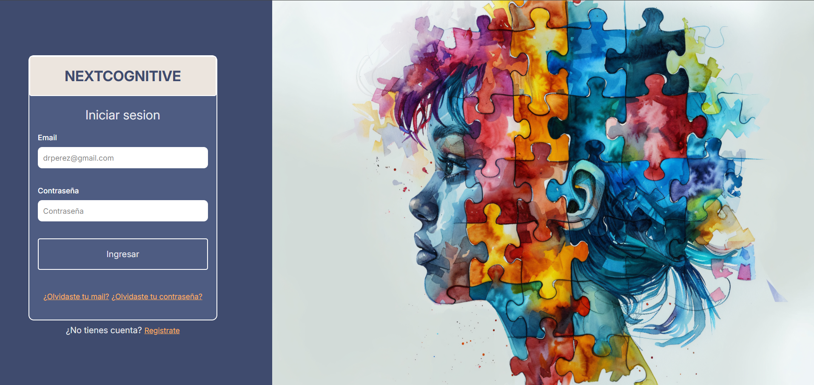
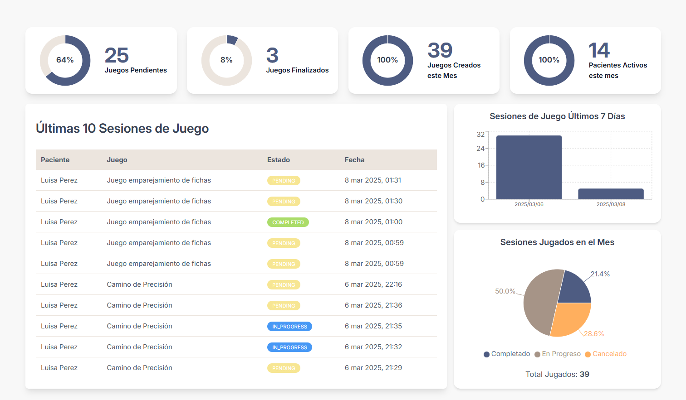
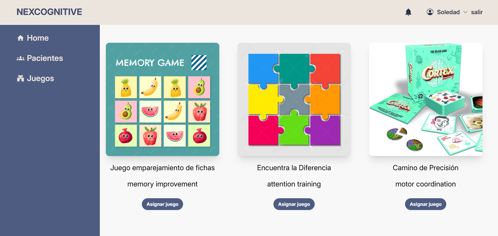
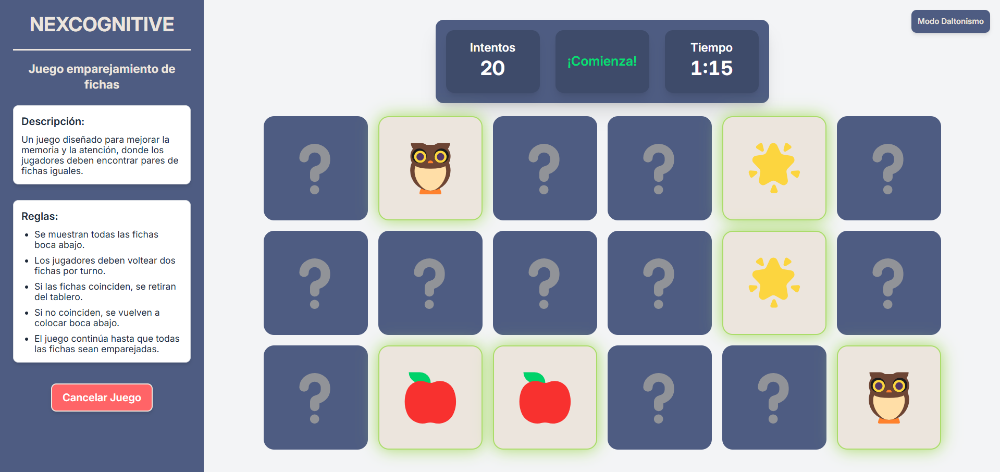

# 🧠 NexCognitive


<div align="center">
  
  
  
  
  
  
  
  
  
  
  
</div>


## 📋 Índice
- [📝 Descripción](#-descripción)
- [✨ Características](#-características)
- [💻 Tecnologías](#-tecnologías)
- [🌐 Ver Proyecto en Producción](#-ver-proyecto-en-producción)
- [🔧 Requisitos](#-requisitos)
- [📥 Instalación](#-instalación)
  - [🖥️ Instalación del Frontend](#-instalación-del-frontend)
  - [🛠️ Instalación del Backend](#-instalación-del-backend)
- [🚀 Guía de Uso](#-guía-de-uso)
  - [✅ Acceso a la Plataforma](#-acceso-a-la-plataforma)
  - [✅ Enviar Juegos a Pacientes](#-enviar-juegos-a-pacientes)
  - [✅ Ejecución del Juego por el Paciente](#-ejecución-del-juego-por-el-paciente)
  - [✅ Seguimiento y Estadísticas](#-seguimiento-y-estadísticas)
- [📖 Documentación Detallada](#-documentación-detallada)
- [📸 Capturas de Pantalla](#-capturas-de-pantalla)
- [📌 Convención de Ramas y Commits](#-convención-de-ramas-y-commits)
  - [💡 Estructura de Ramas](#-estructura-de-ramas)
  - [💡 Convención de Nombres de Ramas](#-convención-de-nombres-de-ramas)
  - [💡 Convención para los Commits](#-convención-para-los-commits)
  - [💡 Flujo de Trabajo con Ramas](#-flujo-de-trabajo-con-ramas)
- [🧑‍💻 Equipo de Desarrollo](#-equipo-de-desarrollo)


## 📝 Descripción

**NexCognitive** es una aplicación web diseñada para apoyar a los profesionales, como psicólogos, educadores, médicos y otros especialistas, en la estimulación cognitiva de sus pacientes mediante juegos interactivos. Su objetivo es ofrecer una herramienta accesible y eficiente que permita  reforzar habilidades cognitivas de manera personalizada.

Actualmente, muchos especialistas carecen de recursos digitales adecuados para monitorear el progreso cognitivo de sus pacientes. **NexCognitive** resuelve esta necesidad al permitir la asignación de sesiones de juego adaptadas, el seguimiento del desempeño y la recepción de notificaciones sobre sus resultados.

La aplicación incluye un juego de emparejamiento de fichas que registra el número de intentos, el tiempo empleado y la cantidad de fichas utilizadas en cada sesión. Además, cuenta con un modo de accesibilidad para daltónicos, que ajusta la paleta de colores para garantizar una experiencia inclusiva. La plataforma está diseñada para expandirse con nuevos juegos que estimulen distintas áreas cognitivas y brinden más opciones tanto para la rehabilitación como para el fortalecimiento cognitivo.


## ✨ Características
- Registro y gestión de pacientes de forma eficiente.  
- Asignación de partidas a los pacientes mediante un enlace enviado por correo.  
- Notificaciones automáticas cuando un paciente finaliza o cancela un juego.  
- Consulta detallada de estadísticas sobre el desempeño de los pacientes en cada sesión.  
- Modo de accesibilidad para daltónicos, que ajusta automáticamente los colores de la interfaz.  


## 💻 Tecnologías

| Área        | Tecnologías                      |
|------------|--------------------------------|
| 🖥️ **Frontend** | React, Tailwind CSS        |
| 🛠️ **Backend**  | Spring Boot, PostgreSQL   |
| 🎨 **UX/UI**    | Figma (diseño y prototipado) |
| 🧪 **QA**       | Postman (pruebas de API)   |

## 🌐 Ver Proyecto en Producción

La aplicación web está desplegada y disponible para su uso. Puedes acceder a ella a través del siguiente enlace:

👉 [Ver Proyecto en Producción](https://nexcognitive.onrender.com)


> **⚠️ Importante**: Tener en cuenta que la API podría tardar unos instantes en responder si no ha sido utilizada recientemente, ya que el servidor necesita tiempo para iniciarse. Esto es normal debido a las limitaciones del entorno de ejecución. Si experimentas algún retraso, espera unos minutos hasta que el servidor esté operativo e inténtalo nuevamente.


## 🔧  Requisitos
- Node.js (se recomienda la última versión LTS)
- NPM (Node Package Manager)
- JDK 17 o superior
- Maven para la gestión de dependencias
- PostgreSQL con una base de datos creada
- IntelliJ IDEA (o cualquier otro IDE compatible con Java y Spring Boot)
- Un servidor de email para el envío de notificaciones


## 📥 Instalación

1. **Clona el repositorio**:
    ```bash
    git clone git@github.com:No-Country-simulation/c24-71-ft-webapp.git
    ```

2. **Accede al directorio del proyecto**:
    ```bash
    cd c24-71-ft-webapp
    ```
### 🖥️ Instalación del Frontend

Las instrucciones detalladas para la instalación del frontend se encuentran en el README dentro de la carpeta `Frontend`.  

📄 [Ver instrucciones del Frontend](./Frontend/README.md)  

### 🛠️ Instalación del Backend

Las instrucciones detalladas para la instalación del backend se encuentran en el README dentro de la carpeta `Backend`.  

📄 [Ver instrucciones del Backend](./Backend/README.md)  


## 🚀 Guía de Uso

### ✅ Acceso a la Plataforma
1. Inicia sesión con una cuenta de profesional.  
2. Dirígete a la sección de **Pacientes** para visualizar el listado.  
3. Registra nuevos pacientes y gestiona su información.  

### ✅ Enviar Juegos a Pacientes
1. Accede a la sección de **Juegos**.  
2. Selecciona el juego que deseas asignar a un paciente.  
3. Haz clic en **Asignar juego**, busca el paciente y configura la sesión:  
   - **Número de fichas mostradas en pantalla**.  
   - **Número de intentos estimado**.  
   - **Tiempo estimado para completar la sesión**.
4. Confirma la asignación. El paciente recibirá un correo con un enlace único para acceder a su partida.  

### ✅ Ejecución del Juego por el Paciente
1. Al recibir el correo, el paciente podrá ver las instrucciones.  
2. Al hacer clic en el enlace, será redirigido a la sesión de juego asignada por el profesional.  
3. El paciente podrá **iniciar** o **cancelar** la sesión de juego:  
   - **Si cancela**, podrá enviar una observación sobre la cancelación.  
   - **Si inicia**, accederá al juego asignado por el profesional.  
     - **Juego asignado: Emparejamiento de fichas**  
       - Las fichas se revelarán durante **5 segundos** y luego se ocultarán.  
       - El paciente deberá emparejar todas las fichas.  
       - No hay límite de intentos ni tiempo.  

4. El paciente tiene acceso a un **modo para daltónicos**. Si lo requiere, puede pulsar el botón **Modo Daltonismo**, y los colores de la aplicación se ajustarán automáticamente para mejorar la accesibilidad.  

5. Al completar el juego, se enviarán automáticamente los resultados con:  
   - **Tiempo total empleado**.  
   - **Número de intentos realizados**.  

6. El profesional recibirá un correo con los datos de la sesión finalizada o una notificación si fue cancelada.  


### ✅ Seguimiento y Estadísticas
1. El profesional puede visualizar en su **Dashboard**:  
   - Las últimas **10 sesiones de juego** asignadas.  
   - **Intentos, tiempo y fichas utilizadas** en cada sesión de juego.  
   - **Estadísticas globales** de los pacientes.  


## 📖 Documentación Detallada

Consulta la documentación específica de cada módulo para obtener más información sobre la estructura, funcionalidades, diseño y pruebas del proyecto:

- 🖥️ **Frontend**: [Documentación del Frontend](./Frontend/README.md)
- 🛠️ **Backend**: [Documentación del Backend](./Backend/README.md)
- 🎨 **UX/UI**: [Documentación de UX/UI](./UX-UI/README.md)
- 🧪 **QA**: [Documentación de QA](./QA/README.md)


## 📸 Capturas de Pantalla

A continuación, se presentan algunas capturas de pantalla de la aplicación, mostrando su interfaz gráfica.

### 🔑 Login
Pantalla de inicio de sesión donde los profesionales pueden autenticarse con sus credenciales.



### 📊 Dashboard
Interfaz principal del usuario tras iniciar sesión, mostrando estadísticas y accesos rápidos a las funciones principales.



### 🎮 Gestión de Juegos
Sección donde se pueden administrar los juegos, visualizar listas, crear nuevas sesiones de juego a los pacientes.



### 🧩 Ejecución del Juego (Emparejamiento de fichas)
Vista de la ejecución del juego de emparejamiento de fichas por parte del paciente.




## 📌 Convención de Ramas y Commits

Para mantener un desarrollo ordenado y facilitar el trabajo en equipo, se define una estructura de ramas y un formato de commits. Esto permite un historial claro y facilita la revisión de cambios.

A continuación, se detallan las reglas a seguir para nombrar las ramas y escribir los mensajes de commit.

### 💡 Estructura de Ramas
El monorepo tiene una rama principal `main`, de la cual se derivan ramas base para cada módulo principal del proyecto, como `frontend`, `backend`, `qa` y `ux-ui`. A partir de estas ramas base, se crean ramas específicas para desarrollar funcionalidades concretas.

```text
main ← (rama principal del monorepo)
│
├── frontend ← (rama base del frontend)
│          │
│          ├── fe/auth ← (rama: funcionalidad de autenticación)
│          ├── fe/dashboard ← (rama: funcionalidad del dashboard)
│          └── fe/ui-fixes ← (rama: mejoras en la UI)
│
├── backend ← (rama base del backend)
│          │
│          ├── be/auth ← (rama: módulo de autenticación)
│          ├── be/api-users ← (rama: endpoints de usuarios)
│          └── be/database ← (rama: gestión de base de datos)
│
├── qa ← (rama base para QA)
│         │
│         ├── qa/tests-api ← (rama: tests de API)
│         └── qa/tests-ui ← (rama: tests de interfaz)
│
└── ux-ui ← (rama base de UX/UI)
            │
            ├── ux/login-ui ← (rama: diseño de login)
            └── ux/dashboard-ui ← (rama: mejoras en el dashboard)
```

### 💡 Convención de Nombres de Ramas
Cada rama debe seguir una estructura clara para evitar confusiones:  

#### 📉 Formato:

```
[prefijo]/[nombre-de-la-funcionalidad]
```

#### 📉 Prefijos:
- `fe/` → Frontend  
- `be/` → Backend  
- `qa/` → QA  
- `ux/` → UX/UI  

#### 📉 Ejemplos de nombres correctos:
✅ `be/auth` → Implementación de autenticación en backend  
✅ `fe/dashboard` → Desarrollo del dashboard en frontend  
✅ `qa/tests-api` → Pruebas de API  
✅ `ux/login-ui` → Diseño del login  

#### 📉 Ejemplos de nombres incorrectos:
❌ `feature-login` → No indica en qué parte del proyecto está  
❌ `backend-login-auth` → Demasiado largo y redundante  
❌ `qa` → No es específico


### 💡 Convención para los Commits
Para mantener un historial claro y ordenado, seguimos el formato:  

#### 📉 Formato de commits:

```text
[tipo](módulo): Descripción corta del cambio
```

#### 📉 Tipos de commits:

| Tipo      | Descripción                                      |
|-----------|------------------------------------------------|
| feat      | Nueva funcionalidad                           |
| fix       | Corrección de errores                        |
| refactor  | Mejora del código sin cambiar funcionalidad  |
| docs      | Cambios en documentación                     |
| style     | Cambios en formato, espacios, puntos y comas |
| test      | Agregar o modificar tests                    |
| chore     | Cambios menores o mantenimiento              |

#### 📉 Ejemplos de commits correctos:
✅ `feat(auth): Add JWT authentication system`  
✅ `fix(api-users): Fix error in user data response`  
✅ `refactor(database): Enhance DB connection`  
✅ `docs(readme): Update installation guide`  

#### 📉 Ejemplos de commits incorrectos:
❌ `cambios` → No indica qué se hizo  
❌ `arreglé error en login` → No sigue el formato  
❌ `update file` → Demasiado genérico


### 💡 Flujo de Trabajo con Ramas
Ejemplo de cómo trabajar con las ramas:

❶ **Cambiar a la rama base**


```bash
git switch backend 
```
❷ **Crear una nueva rama desde la base**

```bash
git switch -c be/auth
```
❸ **Hacer cambios en el código y confirmar los commits**

```bash
git status
git add [nombre-del-archivo]
git commit -m "feat(auth): Add JWT authentication system"  
```

❹ **Subir la rama al repositorio**

```bash
git push origin be/auth  
```

❺ **Crear un Pull Request (PR) desde `be/auth` hacia `backend`**


## 🧑‍💻 Equipo de Desarrollo

<div align="center">

### 🖥️ Frontend

| **Christian Aránguiz** | **Romina Gonzalez** |
| :-------- |  :-------- |
|  |  | 
| [](https://www.linkedin.com/in/christian-aranguiz-a2b05a198/)| [](https://www.linkedin.com/in/rominagonzalezdesigner/)|  
| [](https://github.com/NikoDemo96)| [](https://github.com/orwen97)|

</div>

<div align="center">

### 🛠️ Backend

| **Hector Suarez** | **Jissy Merlano** | **Rosario Díaz** | **William Medina** |
| :-------- |  :-------- |  :-------- |  :-------- |
|  |  |  |  | 
| [](https://www.linkedin.com/in/hector-suarez-001415242/)| [](https://www.linkedin.com/in/ing-jissy-merlano/)| [](https://www.linkedin.com/in/madelrosariodiaz/)| [](https://www.linkedin.com/in/william-medinaa/)|
| [](https://github.com/TheHector2614)| [](https://github.com/jissykakin)| [](https://github.com/ChayChaio)| [](https://github.com/william-medina)|

</div>

<div align="center">

### 🧪 QA (Quality Assurance)

| **Lina Parra** |
| :-------- |
|  |
| [](https://www.linkedin.com/in/lina-parra-l/)|
| [](https://github.com/LinapQA)| 

</div>

<div align="center">

### 🎨 UX/UI

| **Victoria Savio** |
| :-------- |
|  |
| [](https://www.linkedin.com/in/victoria-l-savio-43147b173/)|
| [](https://github.com/Vittosaa)| 

</div>
